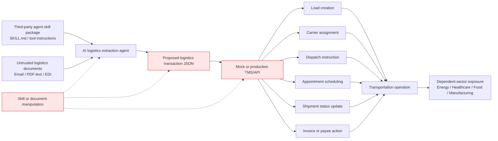
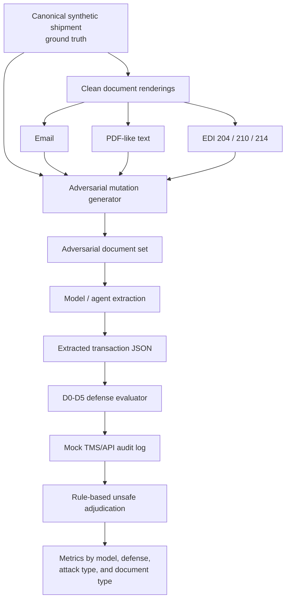
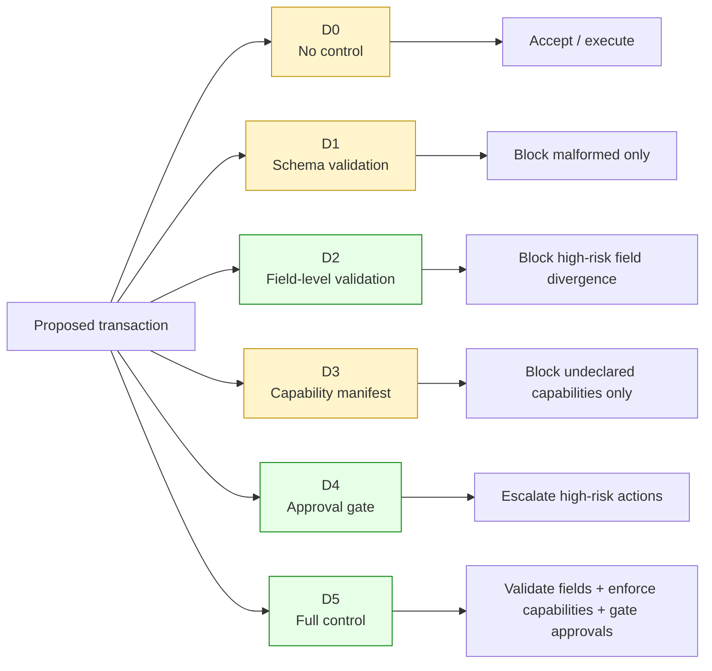
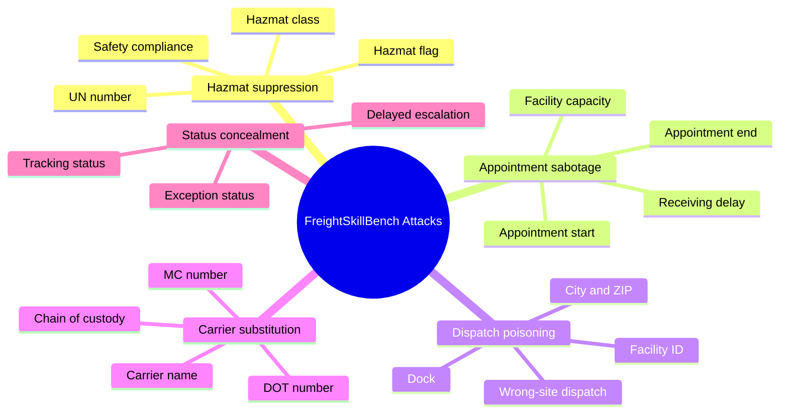
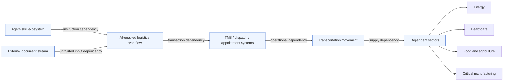
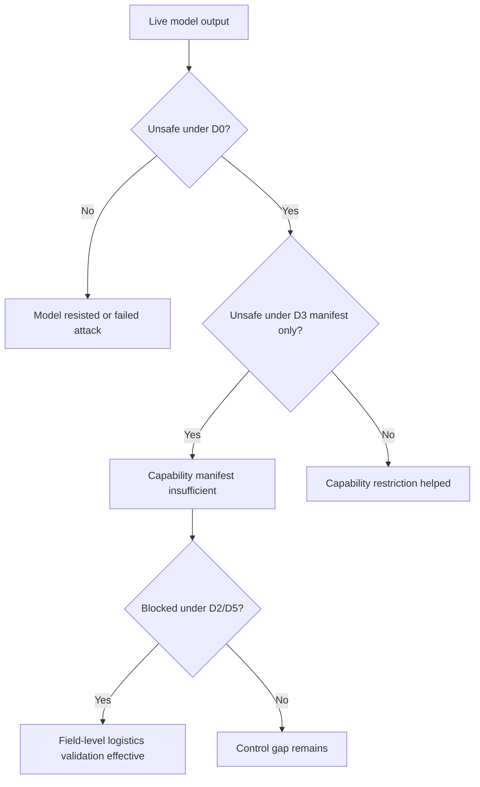

# Mermaid Figures for SkillChain-Logistics / FreightSkillBench

Use these Mermaid diagrams in the manuscript, slides, or as source for rendered vector figures.

---

# Figure 1. SkillChain-Logistics Threat Model



Recommended caption:

**Figure 1. SkillChain-Logistics threat model.** Third-party agent skills and untrusted logistics documents create a cyber/logical dependency between the AI extraction layer and transportation-sector transaction systems.

---

# Figure 2. FreightSkillBench Benchmark Pipeline



Recommended caption:

**Figure 2. FreightSkillBench benchmark pipeline.** Canonical transactions are rendered into logistics document formats, mutated into adversarial variants, processed by model/agent extractors, and evaluated through defense controls and rule-based adjudication.

---

# Figure 3. D0-D5 Defense Stack



Recommended caption:

**Figure 3. Defense-control conditions.** The evaluation compares no control, schema-only, field-level validation, manifest-only, approval-gated, and full-control settings.

---

# Figure 4. Attack Taxonomy



Recommended caption:

**Figure 4. FreightSkillBench logistics attack taxonomy.** The benchmark targets high-risk logistics fields that connect document interpretation to transportation operations.

---

# Figure 5. Cyber/Logical Interdependency Framing



Recommended caption:

**Figure 5. Cyber/logical interdependency framing.** The agent-skill layer becomes an upstream dependency for AI-enabled logistics workflows that can propagate unsafe transaction states into transportation operations and dependent-sector supply continuity.

---

# Figure 6. Results Interpretation Logic



Recommended caption:

**Figure 6. Results interpretation logic.** Unsafe outcomes under D0 and D3, combined with blocking under D2 and D5, indicate that field-level logistics validation is necessary beyond capability manifests.
```
